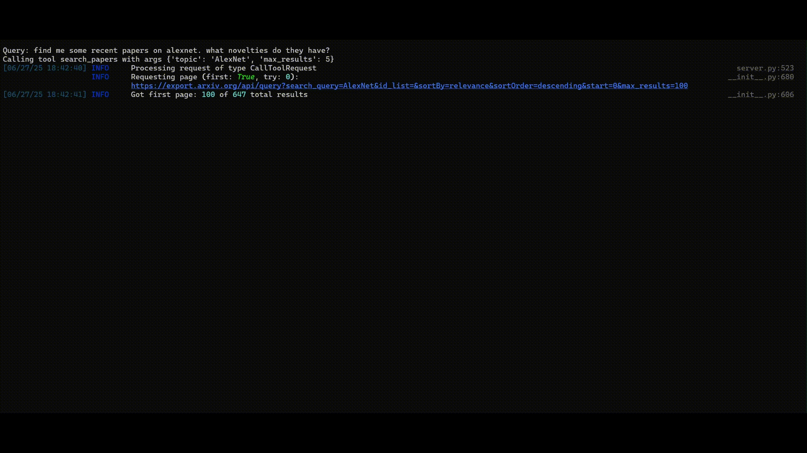

# MCP ChatBot — AI-Powered Tool-Calling Agent

  
  
<em>Terminal demonstration of the chatbot calling tools and responding to user input</em>

---

This project implements a multi-server tool-calling chatbot using OpenAI's `gpt-4o-mini` and the Model Context Protocol (MCP). It connects to local or remote MCP-compatible servers using `stdio`, dynamically discovers available tools, and handles multi-step query execution through AI-initiated tool calls.

---

## Features

- Connects to multiple MCP tool servers (`filesystem`, `research`, `fetch`)
- Automatically discovers and registers available tools
- Uses OpenAI's GPT-4o-mini for parsing and processing user queries
- Supports dynamic tool calling and feedback-based interaction
- Secure configuration using a `.env` file

---

## Directory Structure

